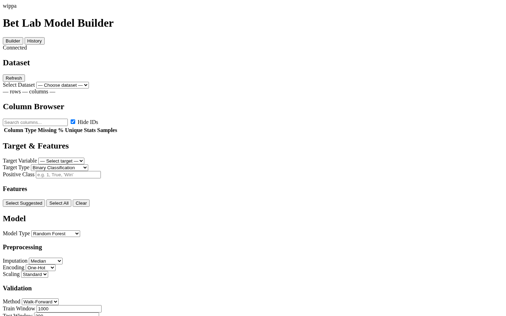

<div align="center">

# wippa-bet-lab

### Sports Betting Research Platform

**Backtest, validate, and paper-trade strategies safely.**

[](https://www.python.org/downloads/)
[](LICENSE)
[](#testing)

</div>

---

## Why this exists

Most betting tools show you picks. Very few prove that a strategy actually survives the full lifecycle — data preprocessing, model training, walk-forward validation, realistic commission/slippage, and bankroll management — before you risk real money.

**wippa-bet-lab** is a research platform that closes that gap. It gives you:

- A reproducible backtesting engine with realistic market simulation
- Walk-forward validation that prevents look-ahead bias
- A paper trading layer for live testing without capital at risk
- A **Model Builder** — a spreadsheet-like ML interface that lets non-coders point, click, and train betting models without writing Python

### Dashboard Preview




## Features

### Core Platform
- **Historical datasets** — CSV, Parquet, JSON import with schema validation
- **Strategy builder** — JSON rule definitions with fluent API
- **Backtesting engine** — commission, slippage, liquidity, partial fills
- **Walk-forward validation** — purged, anchored, expanding window
- **Paper trading** — live simulation with risk limits
- **Bankroll simulation** — Kelly, Monte Carlo, fractional Kelly, drawdown-adjusted
- **Closing-line value tracking** — CLV scoring on every bet
- **Drawdown and volatility analysis** — max drawdown, recovery time, Sharpe proxy
- **Strategy comparison** — side-by-side metrics across experiments
- **Reproducible experiment reports** — HTML, Markdown, JSON

### Model Builder
A spreadsheet-like ML interface for non-coders:
- Point-and-click target/feature selection
- Auto-detected column types with suggestions
- Multiple model types (Logistic Regression, Random Forest, Gradient Boosting, Extra Trees, XGBoost, LightGBM, Dummy Baseline)
- Feature importance and calibration plots
- Walk-forward validation built-in
- Export trained models as betting strategies
- Probability thresholds, edge filtering, staking method selection

## Quick Start

### Install

```bash
git clone https://github.com/wippa-studios/wippa-bet-lab.git
cd wippa-bet-lab
python -m venv .venv
source .venv/bin/activate
pip install -e ".[dev]"
```

### Run the Quickstart

```bash
python examples/quickstart.py
```

This loads a sample tennis dataset, trains a Logistic Regression model, evaluates performance, exports it as a betting strategy, and runs a simulated backtest.

### Run the Full Demo

```bash
python examples/model_builder_demo.py
```

Trains four different model types, compares results, and exports the best model.

### Launch the Dashboard

```bash
uvicorn betlab.api:app --reload --port 8000
```

Open [http://localhost:8000](http://localhost:8000) for the API, or serve the dashboard:

```bash
cd apps/dashboard
python -m http.server 3000
```

### Model Builder via CLI

```bash
# Analyze columns
betlab model columns --dataset tennis-2024

# Preview data
betlab model preview --dataset tennis-2024

# Train a model
betlab model train --dataset tennis-2024 --target result --features "p1_rank,p2_rank,rank_gap,p1_back_price" --model random_forest

# List models
betlab model list

# Show results
betlab model results <model-id>

# Show feature importance
betlab model importance <model-id>

# Export as strategy
betlab model export-strategy <model-id>
```

## Architecture

```
wippa-bet-lab/
├── apps/
│   └── dashboard/               # Web UI (HTML + JS)
│       ├── static/css/          # Dashboard styles
│       ├── static/js/app.js     # Model Builder frontend
│       └── templates/index.html # Dashboard template
├── betlab/
│   ├── api/                     # FastAPI REST API
│   │   └── routers/
│   │       ├── api_models.py    # Model Builder endpoints
│   │       ├── datasets.py      # Dataset management
│   │       ├── experiments.py   # Experiment tracking
│   │       ├── paper.py         # Paper trading
│   │       └── strategies.py    # Strategy CRUD
│   ├── cli/                     # Typer CLI
│   │   ├── app.py               # Main CLI entry
│   │   ├── model_cmd.py         # Model Builder commands
│   │   ├── dataset_cmd.py       # Dataset commands
│   │   ├── strategy_cmd.py      # Strategy commands
│   │   ├── experiment_cmd.py    # Experiment commands
│   │   └── paper_cmd.py         # Paper trading commands
│   ├── ml/                      # Machine Learning
│   │   ├── column_analyzer.py   # Column type detection & suggestions
│   │   ├── evaluator.py         # Metrics, calibration, feature importance
│   │   ├── preprocessor.py      # Preprocessing pipeline
│   │   ├── registry.py          # SQLite model registry
│   │   ├── schemas.py           # Pydantic schemas
│   │   ├── strategy_converter.py # Model → strategy JSON
│   │   └── trainer.py           # Model training
│   ├── backtester/              # Backtesting engine
│   ├── core/                    # Core schemas & database
│   ├── datasets/                # Dataset import/validation
│   ├── metrics/                 # Performance metrics
│   ├── paper/                   # Paper trading
│   ├── reporting/               # Report generation
│   ├── simulator/               # Market & bankroll simulation
│   ├── sports/                  # Sport-specific adapters
│   ├── strategies/              # Strategy builder
│   └── validation/              # Walk-forward, leakage detection
├── datasets/                    # Dataset storage
├── examples/                    # Working examples
├── tests/                       # Test suite (326 tests)
└── pyproject.toml               # Project config
```

## API Reference

### Model Builder Endpoints (`/api/models/`)

| Method | Endpoint | Description |
|--------|----------|-------------|
| `GET` | `/api/models/` | List all trained models |
| `GET` | `/api/models/{model_id}` | Get model details |
| `GET` | `/api/models/{model_id}/metrics` | Get model metrics |
| `GET` | `/api/models/{model_id}/feature-importance` | Get feature importance |
| `GET` | `/api/models/{model_id}/calibration` | Get calibration data |
| `GET` | `/api/models/datasets/{id}/columns` | Column analysis |
| `GET` | `/api/models/datasets/{id}/preview` | Dataset preview |
| `POST` | `/api/models/datasets/{id}/leakage-check` | Detect leakage columns |
| `POST` | `/api/models/train` | Train a model |
| `POST` | `/api/models/{model_id}/export-strategy` | Export model as strategy |
| `POST` | `/api/models/{model_id}/backtest` | Run backtest |

### Other Endpoints

| Method | Endpoint | Description |
|--------|----------|-------------|
| `GET` | `/api/datasets/` | List datasets |
| `POST` | `/api/datasets/import` | Import dataset |
| `GET` | `/api/strategies/` | List strategies |
| `POST` | `/api/strategies/` | Create strategy |
| `GET` | `/api/experiments/` | List experiments |
| `POST` | `/api/paper/sessions` | Create paper session |

## CLI Reference

```bash
betlab model columns    --dataset <id>           # Analyze columns
betlab model preview    --dataset <id>           # Preview data
betlab model train      --dataset <id> --target <col> --features <csv>  # Train
betlab model list                                  # List models
betlab model results    <model-id>                # Show metrics
betlab model importance <model-id>                # Feature importance
betlab model info       <model-id>                # Model details
betlab model export-strategy <model-id>           # Export strategy JSON

betlab dataset list                               # List datasets
betlab dataset import    <file> --sport tennis     # Import dataset
betlab dataset validate  <id>                     # Validate dataset

betlab strategy list                              # List strategies
betlab strategy validate <file>                   # Validate strategy JSON

betlab experiment list                            # List experiments
betlab experiment info   <id>                     # Experiment details

betlab paper status                               # Paper trading status
betlab paper pause       <session-id>             # Pause session
betlab paper resume      <session-id>             # Resume session
betlab paper stop        <session-id>             # Stop session

betlab report <experiment_id> --format html       # Generate report
```

## Testing

```bash
# Run all tests
.venv/bin/python -m pytest tests/ -v --tb=short

# Run specific test file
.venv/bin/python -m pytest tests/test_ml.py -v

# Run with coverage
.venv/bin/python -m pytest tests/ --cov=betlab
```

The test suite covers:
- ML pipeline (column analysis, preprocessing, training, evaluation, strategy conversion)
- Model API endpoints (columns, preview, training, metrics, export)
- CLI commands (all model, dataset, strategy, experiment, paper commands)
- Backtesting engine (commission, slippage, liquidity, bankroll, Monte Carlo)
- Database operations (all CRUD, bulk transactions)
- Sports adapters (tennis, greyhound, NBA)
- Validation (walk-forward, leakage detection, data splitting)
- Reporting (JSON, Markdown, HTML)

## Roadmap

### Phase 1 — Foundation (current)
- [x] Core schema definitions
- [x] SQLite database layer
- [x] Strategy builder with fluent API
- [x] Backtesting engine with market simulation
- [x] Bankroll management (Kelly, fixed stake)
- [x] Walk-forward validation
- [x] CLV tracking
- [x] Paper trading
- [x] CLI interface
- [x] REST API
- [x] ML Model Builder
- [x] Model registry
- [x] Column analysis & suggestions

### Phase 2 — Model Builder v2
- [ ] Hyperparameter tuning (Optuna integration)
- [ ] Model comparison dashboard
- [ ] SHAP explanations
- [ ] Time-series cross-validation
- [ ] Ensemble model support
- [ ] Probability calibration tuning

### Phase 3 — Production
- [ ] Live data connectors (Betfair API)
- [ ] Real-time paper trading
- [ ] Alert system (Telegram, email)
- [ ] Multi-sport expansion
- [ ] Portfolio-level risk management
- [ ] API authentication

## License

MIT — see [LICENSE](LICENSE)
